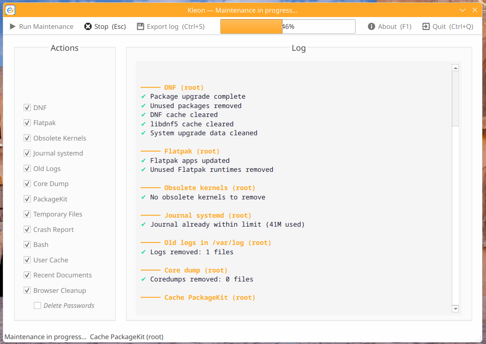

# Eleòra Kleon

A system maintenance utility for Fedora Linux, optimized for KDE Plasma.


---

## Screenshot



---

## Features

* **DNF** — upgrade packages, autoremove unused ones, clean cache, libdnf5 cache and system-upgrade data
* **Flatpak** — update apps and remove unused runtimes
* **Kernel cleanup** — remove obsolete kernel versions
* **systemd journal** — reduce journal size to a configured limit
* **Log files** — delete rotated and compressed logs in /var/log
* **Core dumps** — remove crash dump files
* **Crash reports** — remove ABRT system and user crash reports
* **PackageKit cache** — clear the PackageKit package cache
* **Temporary files** — remove stale files from /tmp and /var/tmp
* **Bash history** — clear root and user history
* **User cache** — clean ~/.cache (preserves KDE essentials) and __pycache__ folders
* **Recent documents** — remove KDE and GTK recent files
* **Browser cleanup** — cache, history, sessions and optionally saved passwords for Brave, Chrome and Firefox
* **SMART summary** — disk health status at the end of each run
* **Log export** — save the full session log to a file
* **Bilingual** — Italian and English, auto-detected from system locale

---

## Important notes

* **Browser cleanup** removes cache, history, sessions, form data and local storage (IndexedDB / service workers). **Cookies are NOT removed**, so you stay logged in. Saved passwords are removed only if the dedicated option is explicitly enabled. The browser must be closed before running cleanup.

* **User cache** cleanup preserves `ksycoca6` files required for KDE Plasma to function correctly.

* **Temporary files** removes entries in /tmp not accessed in the last 24 hours, and entries in /var/tmp not accessed in the last 7 days.

* **SMART summary** requires `smartmontools` to be installed. Without it, the summary section will show no data.

---

## How it works

* Root operations run via `pkexec` — a polkit authentication prompt is shown before they begin
* User-level operations (cache, browser data, Bash history, recent documents, ABRT user reports) run without elevated privileges and only affect the current user's home directory
* All operations run **locally on your machine** — no network requests are made

---

## Requirements

- Fedora Linux
- KDE Plasma
- Python 3.10+
- PySide6
- pkexec (for root operations)
- smartmontools *(optional — required for SMART disk health summary)*

---

## Installation

```bash
git clone https://github.com/eleora-dev/kleon.git
cd kleon
pip install PySide6 --break-system-packages
python kleon.py
```
---

## Keyboard shortcuts

* `Esc` → stop the current maintenance run
* `Ctrl+S` → export the session log to a file
* `Ctrl+Q` → quit the application
* `F1` → show the About dialog

---

## Privacy

This application does not collect, store, transmit or share any personal data.
All operations are performed locally on your machine.

Full privacy policy: [eleora-dev.github.io/kleon/privacy.html](https://eleora-dev.github.io/kleon/privacy.html)

---

## License

MIT License — see [LICENSE](LICENSE) for details.

---

## Author

Gerardo Perilli · [Eleòra](https://github.com/eleora-dev)
